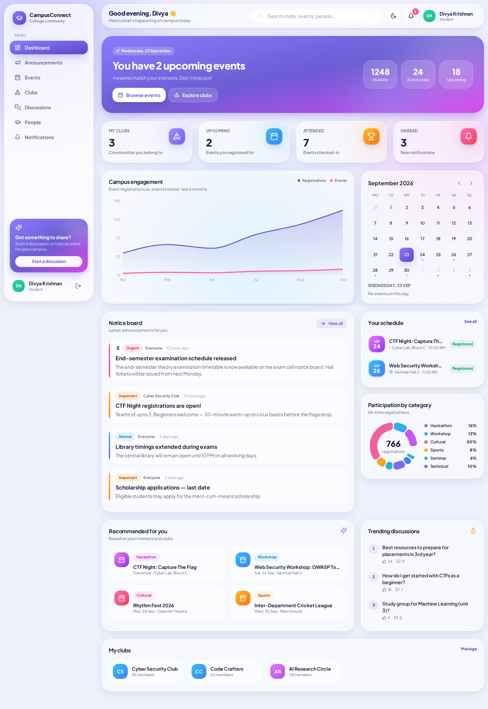
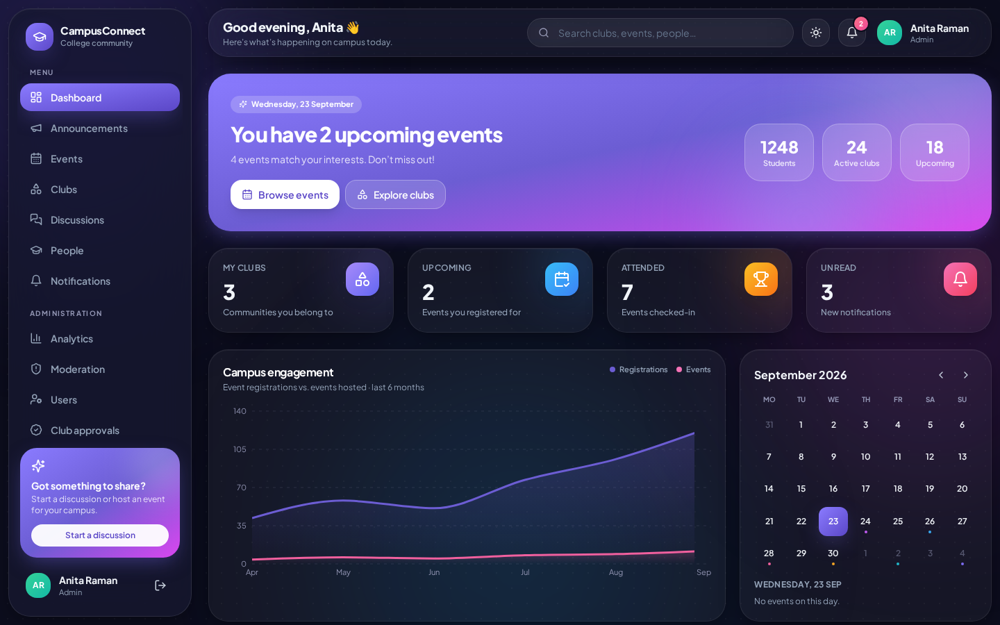
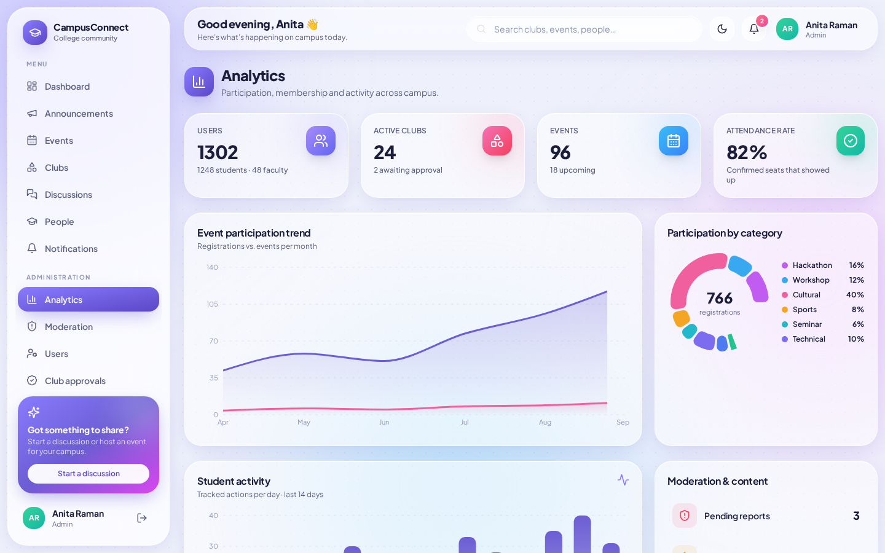
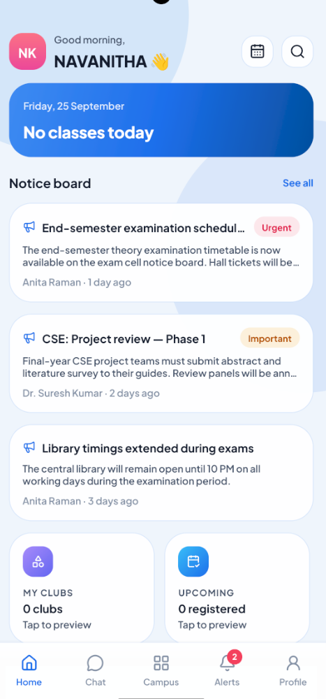

# CampusConnect — College Community Portal
### by VEXON TEAM

A full-stack **MERN** platform (MongoDB · Express · React · Node.js) that brings a college's announcements, clubs, events, discussions and people into one place, with real-time notifications, role-based access and an admin analytics panel.

The UI is a **glassmorphism** take on a modern education admin dashboard. It uses frosted-glass cards, soft gradient backdrops, rounded 28–32 px corners, smooth easing, animated pill buttons and a light and dark theme.



| Dark mode | Analytics |
|---|---|
|  |  |


|MOBILE APP UI |

|---|---|

|  | 


|---|---|
---

## 1. Quick start (local MongoDB Community Server)

### Prerequisites
| Tool | Version |
|---|---|
| Node.js | **18.18+** (20 LTS or 22 recommended) |
| MongoDB Community Server | **6.0+** (uses `$lookup` pipelines, which need 5.0 or later) |

Make sure the MongoDB service is running:

- **Windows:** it's installed as a service ("MongoDB Server"). Check with `services.msc`, or run `net start MongoDB` in an admin terminal.
- **macOS (Homebrew):** `brew services start mongodb-community`
- **Linux:** `sudo systemctl start mongod`

### Run it

```bash
# 1. Install dependencies for root, server and client
npm run install:all

# 2. Configure the API
cp server/.env.example server/.env        # Windows: copy server\.env.example server\.env
#    → set JWT_ACCESS_SECRET and JWT_REFRESH_SECRET to long random strings
#    → MONGO_URI defaults to mongodb://127.0.0.1:27017/campusconnect

# 3. Load demo data (wipes the campusconnect database)
npm run seed

# 4. Start API (port 5000) + React (port 5173) together
npm run dev
```

Open **http://localhost:5173**.

### Demo accounts (password `Password@123`)
| Role | Email |
|---|---|
| Admin | admin@campus.edu |
| Faculty | faculty@campus.edu |
| HOD (CSE) | hod@campus.edu |
| Principal | principal@campus.edu |
| Security | security@campus.edu |
| Club admin | clubadmin@campus.edu |
| Student | student@campus.edu |

The login page has one-click buttons that fill in each demo account.

### Production / single-server mode
```bash
npm run build          # builds client/dist
NODE_ENV=production npm start
```
Express serves the built React app and the API from **one port (5000)**, which is ideal for a campus server. Put it behind Nginx with HTTPS and set `TRUST_PROXY=1` in `.env`.

> Chat, attendance, timetable, gate pass, lost & found, advanced analytics, account security and the **Vexon Android app** are documented in [section 8](#8-campus-features-realtime--android-app).

---

## 2. Tech stack

| Layer | Technology |
|---|---|
| Frontend | React 18, Vite, **Redux Toolkit** + RTK Query, **React Hook Form**, React Router, Tailwind CSS, Recharts, lucide-react, socket.io-client |
| Backend | Node.js, **Express**, **Socket.io**, express-validator, Multer |
| Database | **MongoDB** via Mongoose (text indexes, compound indexes, aggregation pipelines, TTL indexes) |
| Auth | **JWT** (15-min access token + rotating httpOnly refresh cookie), **bcrypt** (12 rounds) |
| Files | Multer, stored locally in `server/uploads`, with optional **Cloudinary** (set the 3 `CLOUDINARY_*` vars) |
| Security | helmet (CSP), CORS allow-list, rate limiting, NoSQL-injection sanitising, magic-byte upload validation, account lockout, audit log |

---

## 3. Features vs. the problem statement

| Requirement | Where |
|---|---|
| Auth + roles (Student, Club Admin, Faculty, Admin) | `server/src/controllers/authController.js`, `middleware/auth.js` (`protect`, `authorize`) |
| Student profiles: academics, department, interests, skills, achievements, extracurriculars | `/profile` → *Edit profile* (RHF `useFieldArray` for achievements) |
| Announcements with audience targeting (everyone, department, year, club), priority, deadlines, attachments, pinning | `/announcements` |
| Club profiles, member management, **join-request → approve** workflow, promote or demote club admins | `/clubs/:slug` → *Members* / *Requests* tabs |
| New club **requests with admin approval** | `/admin/clubs` |
| Events with registration, **participation limits and an automatic waitlist**, registration deadline, attendance marking, CSV export | `/events`, `/events/:id` |
| Event discovery by **category, date range, club and interests ("For you")** | `/events` filter bar |
| Discussion forum with replies, upvotes, sorting (latest, top, unanswered) and **live replies** | `/discussions` |
| Reporting and **moderation queue** (dismiss, hide, warn, delete, suspend) and an **auto-flagging content filter** | `/admin/reports` |
| **Real-time notifications** (Socket.io, toast and bell) | `utils/notify.js`, `AppLayout.jsx` |
| Secure file uploads (posters, logos, avatars, PDF attachments) | `utils/storage.js`, `POST /api/uploads` |
| Global search across clubs, students, events, announcements and discussions | top bar → `/search` (MongoDB **text indexes**, ranked by relevance) |
| Admin panel: users, roles, suspension, clubs, reports | `/admin/*` |
| Analytics dashboards (participation trend, categories, top events and clubs, departments, attendance rate, daily activity) | `/admin` (MongoDB **aggregation pipelines**) |
| Activity tracking and audit log | `models/Activity.js`, `/admin/activity` |

### Role permissions
| Action | Student | Club admin* | Faculty | Admin |
|---|:-:|:-:|:-:|:-:|
| Join clubs, register for events, discuss, report | ✅ | ✅ | ✅ | ✅ |
| Request a new club | ✅ | ✅ | ✅ | creates directly |
| Manage *own* club (members, requests, events, club announcements) | – | ✅ | as advisor | ✅ |
| College-wide events and announcements (all, department, year) | – | – | ✅ | ✅ |
| Moderate discussions and reports, view analytics | – | – | ✅ | ✅ |
| Manage users and roles, approve clubs, suspend, audit log | – | – | – | ✅ |

\*Club-admin rights are **per club** (`club.admins`), so a student who admins one club can't manage others. Public sign-up always creates a **student**. Higher roles are granted only by an admin.

---

## 4. Security design (cyber-security highlights)

- **Short-lived JWT access tokens** (15 min) are kept in memory only, never in localStorage, so XSS can't steal a long-lived token.
- **Per-device sessions with refresh token rotation.** Web clients use an `httpOnly`, `SameSite=Strict` cookie scoped to `/api/auth`; the Android app keeps its refresh token in encrypted SecureStore. Every refresh token names its `Session` row and rotates on use; replaying an old one revokes that session (theft detection). Access tokens are bound to the session too, so **logout signs out only that device**, users can sign out any/all other devices, and password change/reset, role change or suspension revoke sessions immediately — including their live sockets.
- **Brute-force protection:** a 5-failure account lockout (15 min) plus an IP rate limit on auth routes. Sign-in errors use the same generic message for unknown emails and wrong passwords, which prevents user enumeration.
- **RBAC** is enforced on every route on the server. The UI hiding buttons is cosmetic only.
- **Mass-assignment protection:** controllers whitelist writable fields with `pick()`, so users can't set their own `role`.
- **NoSQL injection:** `express-mongo-sanitize` strips `$` and `.` keys, and every regex search input is escaped and length-capped.
- **Input validation** runs on every write endpoint (`express-validator`) and again on the client (React Hook Form).
- **Upload hardening:** files are validated by **magic bytes** (`file-type`), not by the extension or client MIME type. The server enforces a size limit, stores files under random UUID names, and serves them with `X-Content-Type-Options: nosniff` and a restrictive CSP.
- **HTTP hardening:** helmet CSP, `x-powered-by` removed, a CORS allow-list and JSON body size limits.
- **Privacy:** email and phone are visible only to the profile owner, faculty and admins.
- **Audit trail:** logins, content changes and admin actions are recorded with the IP address and kept for 180 days (TTL index).

---

## 5. Project structure

```
campusconnect/
├── package.json                # root scripts (install:all, seed, dev, build, start)
├── server/
│   ├── .env.example
│   └── src/
│       ├── server.js           # HTTP + Socket.io bootstrap
│       ├── app.js              # Express app, security middleware, static hosting
│       ├── config/             # env, db, socket
│       ├── models/             # User, Club, Event, Announcement, Discussion, Report, Notification, Activity
│       ├── controllers/        # business logic per module
│       ├── routes/index.js     # all REST routes + validation rules
│       ├── middleware/         # auth/RBAC, validation, rate limits, errors
│       ├── utils/              # notify, storage, moderation, permissions, visibility, tokens
│       └── seed/seed.js        # demo data
└── client/
    └── src/
        ├── app/store.js        # Redux store
        ├── services/api.js     # RTK Query API slice (auto token refresh)
        ├── services/socket.js  # Socket.io client
        ├── features/           # auth + ui slices
        ├── components/         # layout (Sidebar, Topbar), ui kit (glass primitives, forms, modal), charts
        └── pages/              # dashboard, events, clubs, announcements, discussions, people, admin
```

## 6. REST API overview

All routes are prefixed with `/api`. Every route except register, login, refresh and logout requires `Authorization: Bearer <accessToken>`.

| Module | Endpoints |
|---|---|
| Auth | `POST /auth/register` · `POST /auth/login` · `POST /auth/refresh` · `POST /auth/logout` · `GET /auth/me` · `POST /auth/change-password` |
| Dashboard / search | `GET /dashboard` · `GET /search?q=&type=` |
| Users | `GET /users` · `GET /users/:id` · `PUT /users/me` · `PUT /users/me/avatar` |
| Clubs | `GET/POST /clubs` · `GET/PUT/DELETE /clubs/:id` · `PATCH /clubs/:id/review` · `POST/DELETE /clubs/:id/join` · `POST /clubs/:id/leave` · `GET /clubs/:id/requests` · `POST /clubs/:id/requests/:userId/approve\|reject` · `DELETE /clubs/:id/members/:userId` · `PATCH /clubs/:id/members/:userId/role` |
| Events | `GET/POST /events` · `GET/PUT/DELETE /events/:id` · `POST/DELETE /events/:id/register` · `GET /events/:id/participants` · `PATCH /events/:id/attendance/:userId` |
| Announcements | `GET/POST /announcements` · `PUT/DELETE /announcements/:id` · `PATCH /announcements/:id/pin` |
| Discussions | `GET/POST /discussions` · `GET/PUT/DELETE /discussions/:id` · `POST /discussions/:id/replies` · `DELETE /discussions/:id/replies/:replyId` · `POST /discussions/:id/upvote` · `POST /discussions/:id/replies/:replyId/upvote` · `PATCH /discussions/:id/moderate/lock\|pin\|hide` |
| Reports | `POST /reports` · `GET /reports` · `PATCH /reports/:id` |
| Notifications | `GET /notifications` · `PATCH /notifications/:id/read` · `PATCH /notifications/read-all` · `DELETE /notifications/:id` |
| Uploads | `POST /uploads?kind=image\|document` (multipart field `file`) |
| Admin | `GET /admin/analytics` · `GET /admin/users` · `PATCH /admin/users/:id` · `GET /admin/activity` |

**Socket.io events:** `notification` (server → user room), `discussion:reply` (server → discussion room), `discussion:join` and `discussion:leave` (client → server).

---

## 7. Troubleshooting

| Problem | Fix |
|---|---|
| `Could not connect to MongoDB` | Start the MongoDB service and check `MONGO_URI` in `server/.env`. |
| Port 5000 is already in use (common on macOS: AirPlay) | Set `PORT=5050` in `server/.env` and run the client with `VITE_API_PROXY=http://localhost:5050 npm run dev --prefix client`. |
| Uploads fail with 415 | Only JPG, PNG, WEBP and GIF (plus PDF for attachments) are allowed, max 5 MB. |

---

## 8. Campus features, real-time & Android app

### What was added on top of the existing portal
| Feature | Web | Android | Backend |
|---|---|---|---|
| **Chat**: private + group chats, live delivery, typing, online/last seen, read receipts, unread counts, reply, delete, search | `/chat` | Chat tab | `/api/chat/*` + Socket.io |
| **Attendance**: student view (overall = Σ present ÷ Σ conducted, subject-wise, daily/weekly/monthly trend, history, correction requests, low-attendance warning); faculty console (roster from timetable, mark/edit within 7 days, history, low attendance, corrections, class overview) | `/attendance` | Attendance (student view) | `/api/attendance/*` |
| **Smart timetable**: today/next class, week grid, staff lookup by section, admin CRUD with section/faculty/room clash checks | `/timetable`, `/admin/academics` | Timetable | `/api/timetable`, `/api/subjects` |
| **Digital gate pass**: request, cancel, approve/reject, owner-only QR (opaque 60-bit code, no student data), verify → exit → return (single use), expiry sweep, revoke, overdue tracking | `/gate-pass` | Gate pass (request + QR) | `/api/gate-pass/*` |
| **Lost & found**: report with photo, search/filters, possible-match suggestions (never an ownership claim), staff linking/handover, owner close/withdraw | `/lost-found` | Lost & found | `/api/lost-found/*` |
| **Advanced analytics** (day/week/month/semester/custom): student, faculty classes, department/section, college, club, gate | `/analytics`, club “Insights” tab | Home tiles | `/api/analytics/*` |
| **Account security**: forgot/reset password, change password, per-device sessions, sign out one/other devices, login history (incl. failures), new-device alerts | `/forgot-password`, `/reset-password`, `/settings/security` | Login, forgot password, Security | `/api/auth/*` |

Students are placed in a class by an admin (**User management → click the department cell** to set department, year, section, semester, roll no). Subjects and timetables are managed at **Administration → Academics**.

### Development data
`npm run seed` now also loads **clearly-separated demo academic data** (`server/src/seed/academic.js`): sections for the demo students, six CSE-A classmates, five CSE semester-5 subjects, a weekly timetable and four weeks of attendance. To add it to an existing database without wiping anything:
```bash
npm run seed:academic --prefix server
```

### Real-time model
REST does all reads/writes; Socket.io only pushes “something changed” signals and chat traffic:
`client → REST → auth/validation → MongoDB → Socket.io event → authorised clients`.
Sockets authenticate with the access token **and a live session**; chat rooms are joined only after a MongoDB membership check; revoking a session disconnects its sockets. Broadcast events for public data (`announcement:changed`, `event:changed`, …) carry only an id, so every client re-reads through REST with its own permissions.

### Password-reset email
Set `SMTP_*` and `APP_URL` in `server/.env` (see `.env.example`). Without `SMTP_HOST` the request is still accepted (same response, no account enumeration) but no mail can be sent — the server logs a warning, never the token. Reset links are single-use, expire after 15 minutes and put the token in the URL fragment so it never reaches server logs.

### Android app (`mobile/`, React Native + Expo SDK 57)
Uses the **same backend, database, roles and Socket.io server** as the web app. The refresh token is stored in the device’s encrypted SecureStore and sent in the request body (`X-Client-Platform: mobile`); everything else is identical to the web client.

```bash
cd mobile
npm install
cp .env.example .env        # set EXPO_PUBLIC_API_URL=http://<your-PC-LAN-IP>:5000 for a phone on the same Wi-Fi
npx expo start              # scan the QR with Expo Go, or press "a" for an Android emulator
```
In development the app falls back to the machine running `expo start` on port 5000 if `EXPO_PUBLIC_API_URL` is empty. It never defaults to `localhost`.

**Building the APK** (EAS Build; profiles in `mobile/eas.json`):
```bash
npm install -g eas-cli
cd mobile
eas login                   # Expo account (free)
eas init                    # creates the project; put the printed id in EAS_PROJECT_ID
# edit eas.json → "preview".env.EXPO_PUBLIC_API_URL = your deployed server, e.g. https://vexon.your-college.edu
eas build -p android --profile preview      # cloud build → downloadable .apk
# or, with Android SDK + JDK 17 installed locally:
eas build -p android --profile preview --local
```
Push notifications on a standalone APK additionally need Firebase (FCM v1) credentials uploaded with `eas credentials` and `GOOGLE_SERVICES_JSON` pointing to `google-services.json`. Plain-HTTP servers are allowed only when `EXPO_PUBLIC_API_URL` is `http://` (campus LAN); use HTTPS in production.

**Using the app over the internet (mobile data, any Wi-Fi, no laptop involved):** the phone needs a *public* address for the API — a LAN IP only works on the same Wi-Fi, and `localhost` never works on a phone at all.

1. **Database — MongoDB Atlas** (free tier, 512 MB): create a cluster at [mongodb.com/atlas](https://www.mongodb.com/atlas) → Database Access (create a user) → Network Access (Allow access from anywhere, `0.0.0.0/0`, since Render's IP isn't static) → Connect → copy the `mongodb+srv://...` connection string.
2. **API — Render**, using the `render.yaml` at the repo root (a "Blueprint"): on [dashboard.render.com](https://dashboard.render.com) → New → Blueprint → pick this repo. Render reads `render.yaml` and creates the `vexon-api` web service itself — JWT secrets and the chat encryption key are generated for you. You only need to fill in `MONGO_URI` (from step 1) when prompted, and optionally `CLOUDINARY_*` (see below). First deploy takes a few minutes; the resulting URL looks like `https://vexon-api.onrender.com`. The free plan sleeps after 15 minutes idle — the first request after that takes ~30s to wake it, then it's instant.
3. **Uploaded photos surviving restarts:** Render's own disk is wiped on every deploy/restart. The server already supports [Cloudinary](https://cloudinary.com) (free tier) as a drop-in replacement — sign up, copy your Cloud name / API key / API secret into the Render service's environment variables, and uploads switch to Cloudinary automatically (no code change, no redeploy needed beyond setting the vars).
4. **The APK:** either build it with the Render URL baked in (`eas.json` → `preview.env.EXPO_PUBLIC_API_URL` → your `https://vexon-api.onrender.com`, then `eas build -p android --profile preview`), **or** build once with no URL set and instead open the app's login screen → tap **Server** → enter the address → **Test & save**. The address is then stored on the phone itself, so the same APK can be repointed at a new server later without rebuilding.
5. Install the resulting `.apk` on the phone (Settings → allow installs from your browser/file manager) and sign in — it now works over Jio/Airtel/any network, with your laptop not needed at all once deployed.

For a *temporary* demo without deploying anything, an HTTPS tunnel to your running laptop works too (e.g. `cloudflared tunnel --url http://localhost:5000`) — but that only works while the tunnel and your laptop's dev server stay running, and anyone with the link can reach it, so use it briefly and not for real use.

Reliability on mobile networks: every request has a 20 s timeout, reads retry automatically on network errors (writes never do, so nothing is saved twice), screens refetch when the app returns to the foreground or the connection comes back, an "Offline — reconnecting…" banner shows while the server is unreachable, a launch without internet keeps you signed in with a **Try again** screen, and a screen that crashes shows a recoverable error page instead of closing the app.

### Tests
```bash
npm test --prefix server                     # 43 integration tests (uses the separate cmp_test database)
node server/scripts/realtime-smoke.mjs       # against a RUNNING server: web ↔ Android chat round-trip
```
